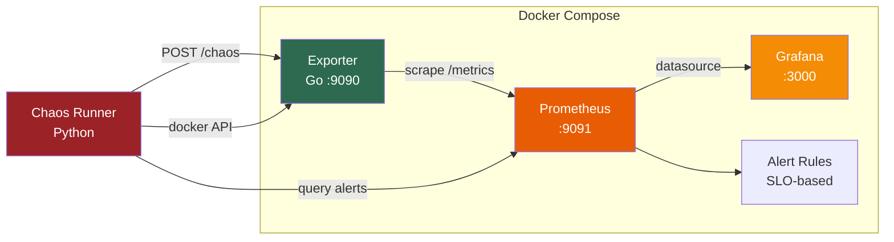

# Observability Toolkit

**Custom Prometheus exporter with chaos engineering validation**

A purpose-built observability stack that demonstrates SRE best practices: custom metric collection, SLO-based alerting, automated dashboards, and chaos engineering validation — all wired together in a reproducible Docker Compose environment.

---

## Design Document

### Problem

Standard Prometheus exporters (node_exporter, cAdvisor) capture infrastructure metrics but miss **application-specific health signals** that are critical for SLO-based operations:

- **DB connection pool saturation** — when active connections approach the pool maximum, new queries queue up, causing cascading latency increases. Generic exporters don't expose pool internals.
- **Queue backpressure** — rising queue depth is a leading indicator of downstream degradation. By the time CPU or memory alerts fire, users are already impacted.
- **Cache efficiency** — a dropping cache hit rate means more requests hit the slower backing store. This is invisible to infrastructure-level monitoring.

### Trade-offs

| Decision | Chosen | Alternative | Rationale |
|---|---|---|---|
| Collection model | Pull-based custom exporter | Push (StatsD/OTLP) | Decouples collection from application lifecycle; native Prometheus compatibility; simpler HA (Prometheus handles retry) |
| Exporter language | Go | Python, Rust | Go is the Prometheus ecosystem language; `client_golang` is the reference implementation; goroutines handle concurrent metric collection efficiently |
| Alerting approach | SLO-based thresholds | Static thresholds | SLOs align alerts with user impact; reduces alert fatigue by focusing on what matters |
| Chaos validation | Python scripts + Docker API | Litmus/Chaos Monkey | Lightweight, no cluster dependencies; validates the specific alerting pipeline we built |

### Outcome

- SLO breach detection in **under 60 seconds** with custom dashboards
- End-to-end validation via chaos engineering proves the alerting pipeline works
- Fully reproducible with `make up` — zero manual configuration

---

## Architecture



**Data flow:** The Go exporter collects application-level metrics (DB pool, queue, cache) and exposes them on `/metrics`. Prometheus scrapes every 15s, evaluates SLO-based alert rules, and feeds Grafana dashboards. The chaos runner injects failures to validate the full pipeline.

---

## Quick Start

```bash
# Start everything (exporter + Prometheus + Grafana)
make up

# View metrics
curl http://localhost:9090/metrics

# Open Grafana dashboard
open http://localhost:3000  # admin/admin

# Run chaos engineering tests
make chaos-spike

# Tear down
make down
```

---

## Tech Stack

| Component | Technology | Purpose |
|---|---|---|
| Exporter | Go 1.23 + client_golang | Custom Prometheus metric collection |
| Monitoring | Prometheus | Time-series storage, PromQL, alerting |
| Dashboards | Grafana | Visualization, auto-provisioned |
| Chaos | Python + Docker SDK | Failure injection and alert validation |
| Orchestration | Docker Compose | Single-command reproducible environment |

---

## Structure

```
observability-toolkit/
├── cmd/exporter/          # Exporter entry point
│   └── main.go
├── internal/
│   ├── collector/         # Prometheus collector implementation
│   │   ├── collector.go   # Top-level collector (aggregates sub-collectors)
│   │   ├── dbpool.go      # Database connection pool metrics
│   │   ├── queue.go       # Message queue metrics
│   │   └── cache.go       # Cache performance metrics
│   └── simulator/         # Realistic metric value generation
│       └── simulator.go
├── chaos/                 # Chaos engineering scripts
│   ├── chaos_runner.py    # CLI runner
│   └── scenarios/         # Individual chaos scenarios
├── prometheus/
│   ├── prometheus.yml     # Scrape configuration
│   └── rules/             # SLO-based alerting rules
├── grafana/
│   ├── provisioning/      # Auto-configuration (datasources, dashboard provider)
│   └── dashboards/        # Dashboard JSON definitions
├── docs/                  # SLO definitions and design docs
├── docker-compose.yaml
├── Dockerfile
├── Makefile
└── go.mod
```

---

## Logging Profile (Loki)

The metrics stack can be extended with **Loki + Promtail** for log aggregation:

```bash
make up-logs    # metrics + Loki/Promtail/Grafana on :3001
make down-logs
```

Grafana (logs instance): http://localhost:3001 — Explore → Loki → `{container=~".+"}`

Files: `docker-compose.loki.yaml`, `loki/loki-config.yaml`, `loki/promtail-config.yaml`

---

## Future Enhancements

- **OpenTelemetry bridge** — export metrics via OTLP in addition to Prometheus scraping
- **Real data sources** — connect to actual PostgreSQL, Redis, and RabbitMQ instances
- **Kubernetes deployment** — Helm chart with ServiceMonitor for Prometheus Operator
- **Runbook automation** — trigger remediation scripts when specific alerts fire
- **Load testing integration** — coordinate chaos scenarios with k6 load tests
- **Multi-tenant metrics** — add tenant labels for SaaS-style metric isolation
