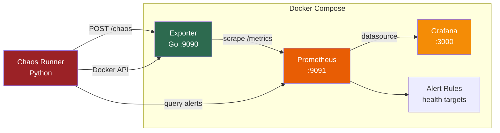

# Observability Toolkit

**Learn how to watch your app, set health targets, and prove your alerts actually work**

This project is a small, runnable demo of **observability** — the practice of measuring how your software is doing so you can fix problems before users notice.

You get a fake app that reports numbers (database usage, queue size, cache hits), tools that collect and graph those numbers, alerts when things look wrong, and scripts that deliberately break things so you can confirm the alerts fire.

No prior Site Reliability Engineering (SRE) or Prometheus experience required. If you can run `make up`, you can follow along.

---

## What you'll learn

| Topic | Plain English |
|---|---|
| **Metrics** | Numbers your app reports over time (e.g. "42 requests waiting") |
| **Monitoring** | Collecting those numbers and storing them |
| **Dashboards** | Charts that make the numbers easy to read |
| **Service Level Indicators (SLIs)** | The specific numbers you measure (e.g. queue depth, cache hit rate) |
| **Service Level Objectives (SLOs)** | Agreed targets for "healthy" (e.g. "queue should stay under 100 messages") |
| **Alerting** | Notifications when a target is missed |
| **Chaos testing** | Intentionally causing problems to verify alerts work |

---

## The problem this solves

Most off-the-shelf monitoring tools tell you about **servers** (CPU, memory, disk). They often miss **application** signals that actually affect users:

- **Database connection pool** — Think of a parking lot with limited spaces. When it's almost full, new requests wait in line and everything slows down.
- **Queue depth** — Messages waiting to be processed. A growing backlog usually means trouble *before* CPU alerts go off.
- **Cache hit rate** — How often fast memory answers a request vs. hitting the slow database. A dropping rate means more slow requests.

This project shows how to measure those app-level signals, set sensible targets, and test that your alerts catch real problems.

---

## How it works



**In order:**

1. A **Go exporter** (small program) exposes fake-but-realistic app metrics at `/metrics`.
2. **Prometheus** (time-series database) pulls those numbers every 15 seconds.
3. **Grafana** draws dashboards from Prometheus data.
4. **Alert rules** compare metrics to Service Level Objective (SLO) targets (see [docs/slo-definitions.md](docs/slo-definitions.md)).
5. **Chaos scripts** spike metrics or kill processes to prove alerts fire end-to-end.

---

## Quick start

```bash
# Start everything (exporter + Prometheus + Grafana)
make up

# See raw metrics (plain text numbers)
curl http://localhost:9090/metrics

# Open dashboards in your browser
open http://localhost:3000  # login: admin / admin

# Run a chaos test (spike metrics, check alerts)
# One-time chaos setup on Ubuntu 24.04+ (PEP 668 — use a venv, not system pip):
#   sudo apt-get install -y python3-venv
#   python3 -m venv .venv && source .venv/bin/activate
#   pip install -r chaos/requirements.txt
make chaos-spike

# Stop everything
make down
```

---

## Chaos engineering setup

Chaos scripts need Python packages (`docker`, `requests`, `click`). On **Ubuntu 24.04+**, system Python is externally managed — use a **virtual environment**:

```bash
sudo apt-get install -y python3-venv   # once, if venv creation fails
python3 -m venv .venv
source .venv/bin/activate
pip install -r chaos/requirements.txt
make up
make chaos-spike    # or chaos-kill, chaos-stress
```

`make` automatically uses `.venv/bin/python` when `.venv` exists. Ensure the stack is running (`make up`) before chaos scenarios that talk to Docker.

---

| Piece | Technology | What it does |
|---|---|---|
| Exporter | Go | Collects and publishes app metrics |
| Prometheus | Prometheus | Stores metrics, runs alert rules |
| Grafana | Grafana | Visualizes metrics in dashboards |
| Chaos scripts | Python | Breaks things on purpose to test alerts |
| Orchestration | Docker Compose | Starts the whole stack with one command |

---

## Project layout

```
observability-toolkit/
├── cmd/exporter/          # Exporter entry point
├── internal/
│   ├── collector/         # Metric collectors (DB pool, queue, cache)
│   └── simulator/         # Generates realistic fake values
├── chaos/                 # Chaos testing scripts
├── prometheus/            # Scrape config + alert rules
├── grafana/               # Dashboards (auto-loaded)
├── docs/                  # Health target definitions
├── docker-compose.yaml
└── Makefile
```

---

---

## Design choices (for the curious)

| Decision | Why |
|---|---|
| Pull-based metrics | Prometheus asks the exporter for data (simple, reliable retries) |
| Go for the exporter | Standard language in the Prometheus ecosystem |
| Target-based alerts | Alert on user impact, not arbitrary CPU thresholds |
| Python chaos scripts | Lightweight; no extra cluster needed |

Details and Prometheus Query Language (PromQL) examples: [docs/slo-definitions.md](docs/slo-definitions.md).

---

## Ideas for extending this

- Connect to real PostgreSQL, Redis, or RabbitMQ instead of simulated data
- Export metrics via OpenTelemetry (OTel) — an industry-standard telemetry format
- Deploy on Kubernetes (K8s) with a Helm chart
- Auto-run fix scripts when specific alerts fire

